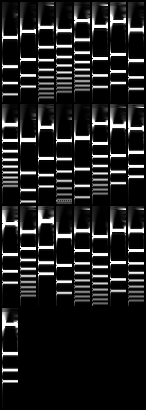
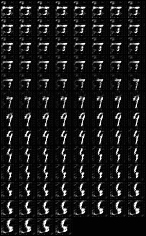
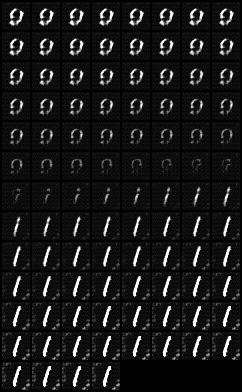

# Disentangling variation factors in audio samples

ATIAM's Master computer science project. Its main purpose is to get students to actually do machine learning.
## The project
Our goal is to build a model that will build its own representation of an audio dataset. In this case, we designed a "toy dataset" and we're trying to get the net to fit the dimensions we design the dataset with. We tested the behaviour of our models with the MNIST dataset (http://yann.lecun.com/exdb/mnist/).

### Team
This project is part of the Master ATIAM at UPMC-IRCAM-Télécom ParisTech

# Toy Dataset
We first used this list of feature to build it, using additive synthesis (see `audioEngine` class) is:
* **Fundamental frequency**
* **Spectral slope**
* **Signal to Noise Ratio** (SNR)
* **Harmonic presence** (all, odd only, even only)
* **Inharmonicity**

After a few tries on spectrograms, we conclueded that some of the features were too complex for the model to understand, and the SNR 
parameter was making the net not converge. So we ended up using this list of features:
* **Fundamental frequency**: 100 to 1000 Hz, every 50Hz
* **Spectral slope**: -0.1 to -0.9 every  0.1
* **Inharmonicity**: 0 to 1 every 0.1
* **Exponential time decay**: 0 to 10 every 1

The `generateParameterSpace` module gets a default dictionary that specifies those values (start, stop, increment). It generates a cardinal product (permutations) between every sampled dimension. The dataset can get huge pretty quickly. A list of parameters is then given to the `AudioEngine` object that renders audio, spectrograms and CQT for every list of parameters.

Here is a list of CQT randomly taken from the dataset:

Everything else is explained in the [toyDataset README](toyDataset/README.md).

## Models
Models are contained in the `framework` folder. Further details in the [Framework README](framework/README.md).

### MNIST: VAE behaviour
When beta is set to 1, we obtain a simple VAE. Here you can see a visualization of the latent space.

### MNIST: beta-VAE behaviour for differents Beta values
The effect of beta is to force the disentanglement of visual factors. Here you can see that the net uses one latent dimension for number, and not for lower level features (line, curve, angle for instance).

### Install requirements
`pip install -r requirements.txt`
